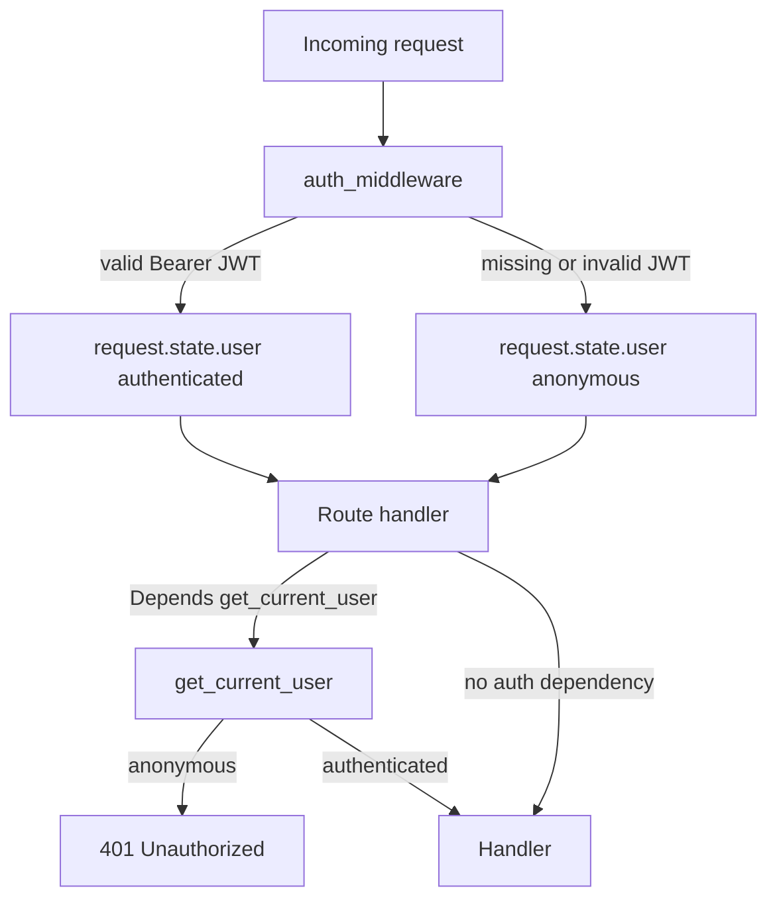
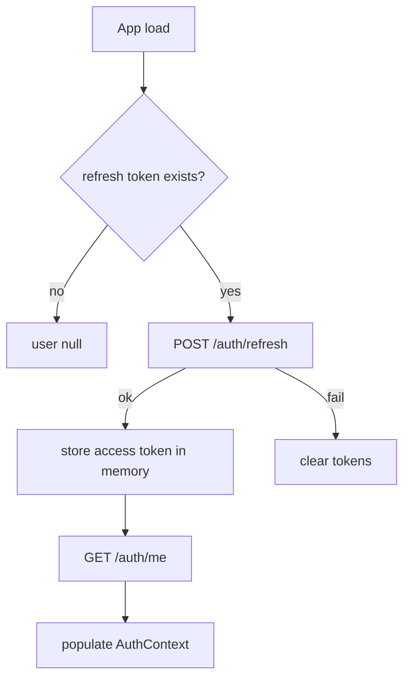

# Authentication

Smart Stock uses a simple JWT authentication MVP:

* The middleware parses an optional Bearer access token and populates `request.state.user`.
* Middleware never blocks requests.
* Protected routes use `get_current_user`; public routes do not.
* Password accounts must verify email before login.
* Google OAuth is the primary social login. Facebook is optional and configuration-gated.

## Request Flow



Routers must not decode JWTs. They either stay public or depend on `get_current_user`.

## Tokens

Access tokens are JWTs signed with `JWT_SECRET_KEY` and `JWT_ALGORITHM` (`HS256` by default). They are short lived.

Refresh tokens are opaque random strings. Only their SHA-256 hash is stored in `refresh_tokens`.

Access token claims:

```json
{
  "sub": "user-uuid",
  "email": "user@example.com",
  "display_name": "User",
  "type": "access",
  "iat": 1710000000,
  "exp": 1710000900
}
```

## Email Registration

```mermaid
flowchart TD
  register[POST /auth/register] --> createUser[Create unverified user]
  createUser --> token[Generate verification token]
  token --> email[Send email]
  email --> click[User opens /verify-email?token=...]
  click --> verify[POST /auth/verify-email]
  verify --> verified[email_verified_at = now]
  verified --> login[User can log in]
```

Example:

```bash
curl -X POST http://localhost:8000/api/v1/auth/register \
  -H "Content-Type: application/json" \
  -d '{"email":"trader@example.com","password":"strong-password","display_name":"Trader"}'
```

Verify:

```bash
curl -X POST http://localhost:8000/api/v1/auth/verify-email \
  -H "Content-Type: application/json" \
  -d '{"token":"verification-token-from-email"}'
```

## Login And Refresh

```bash
curl -X POST http://localhost:8000/api/v1/auth/login \
  -H "Content-Type: application/json" \
  -d '{"email":"trader@example.com","password":"strong-password"}'
```

Response data:

```json
{
  "access_token": "jwt",
  "refresh_token": "opaque-refresh-token",
  "token_type": "bearer",
  "expires_in": 900
}
```

Refresh:

```bash
curl -X POST http://localhost:8000/api/v1/auth/refresh \
  -H "Content-Type: application/json" \
  -d '{"refresh_token":"opaque-refresh-token"}'
```

Refresh rotates the refresh token by revoking the old row and creating a new one.

## Logout

Logout only needs a refresh token:

```bash
curl -X POST http://localhost:8000/api/v1/auth/logout \
  -H "Content-Type: application/json" \
  -d '{"refresh_token":"opaque-refresh-token"}'
```

The matching refresh token is revoked. Existing access tokens remain valid until their short expiry.

## Current User

```bash
curl http://localhost:8000/api/v1/auth/me \
  -H "Authorization: Bearer access-jwt"
```

`/auth/me` uses `get_current_user`.

## Change Password

```bash
curl -X PATCH http://localhost:8000/api/v1/auth/change-password \
  -H "Authorization: Bearer access-jwt" \
  -H "Content-Type: application/json" \
  -d '{"current_password":"old-password","new_password":"new-strong-password"}'
```

Changing password revokes all refresh tokens for that user.

## Google OAuth

Frontend uses `@react-oauth/google` to get a Google ID token. Backend verifies it using `google-auth`:

```bash
curl -X POST http://localhost:8000/api/v1/auth/google \
  -H "Content-Type: application/json" \
  -d '{"id_token":"google-id-token"}'
```

If the Google identity is new, the backend links it to an existing user with the same email or creates a user. Google-verified email sets `email_verified_at`.

## Facebook OAuth

Facebook is optional. When `FACEBOOK_APP_ID` and `FACEBOOK_APP_SECRET` are configured, `POST /auth/facebook` can validate an access token through Meta Graph APIs and issue the same token pair.

## Frontend Startup



The frontend keeps the access token in memory and the refresh token in `localStorage` for the MVP. This is simple and works for a single-page app, but it means XSS prevention remains important. A future backend-for-frontend or httpOnly cookie approach can reduce refresh token exposure.

## Configuration

Environment variables are loaded from `backend/.env` (copy from `backend/.env.example`) and `frontend/.env.local` (copy from `frontend/.env.example`).

### Quick reference

**Backend** (`backend/.env`):

| Variable | Required | Purpose |
| --- | --- | --- |
| `JWT_SECRET_KEY` | Yes | Signs access JWTs. Use a long random string in production. |
| `FRONTEND_BASE_URL` | Yes | Base URL for verification links in emails (e.g. `http://localhost:3000`). |
| `GOOGLE_CLIENT_ID` | Yes for Google login | Same OAuth client ID as the frontend. |
| `SMTP_HOST` | Yes for email register | SMTP server hostname. |
| `SMTP_PORT` | Yes for email register | Usually `587` (STARTTLS) or `465` (SSL). |
| `SMTP_USER` | Yes for email register | SMTP username / login. |
| `SMTP_PASSWORD` | Yes for email register | SMTP password or app password. |
| `MAIL_FROM` | Yes for email register | From address on outgoing mail. |
| `FACEBOOK_APP_ID` | No | Enables Facebook login when set with secret. |
| `FACEBOOK_APP_SECRET` | No | Meta app secret for token validation. |

**Frontend** (`frontend/.env.local`):

| Variable | Required | Purpose |
| --- | --- | --- |
| `NEXT_PUBLIC_API_BASE_URL` | Yes | API root, e.g. `http://localhost:8000/api/v1`. |
| `NEXT_PUBLIC_GOOGLE_CLIENT_ID` | Yes for Google button | OAuth Web client ID (public). |
| `NEXT_PUBLIC_FACEBOOK_APP_ID` | No | Shows Facebook button when set. |

After changing env files, restart the backend (`uvicorn`) and the Next.js dev server.

---

## Setup guide: SMTP (verification email)

Smart Stock sends registration verification links through SMTP (`backend/app/modules/mail/mail_service.py`).

### 1. Choose an SMTP provider

Common options:

- **Gmail / Google Workspace** — use an [App Password](https://support.google.com/accounts/answer/185833) (2FA must be on). Host: `smtp.gmail.com`, port `587`.
- **SendGrid** — create an API key or SMTP credentials in the dashboard. Host: `smtp.sendgrid.net`, port `587`, user often `apikey`, password = your API key.
- **Mailtrap** (development) — use the SMTP inbox credentials from Mailtrap; good for local testing without sending real mail.
- **Amazon SES, Postmark, Brevo** — use the SMTP credentials from their console.

### 2. Put credentials in `backend/.env`

```env
SMTP_HOST=smtp.gmail.com
SMTP_PORT=587
SMTP_USER=you@gmail.com
SMTP_PASSWORD=your-app-password-or-smtp-password
MAIL_FROM=you@gmail.com
FRONTEND_BASE_URL=http://localhost:3000
```

`FRONTEND_BASE_URL` must match where the frontend runs. Verification links look like:

`{FRONTEND_BASE_URL}/verify-email?token=...`

### 3. Test registration

1. Start Postgres and run migrations: `alembic upgrade head` from `backend/`.
2. Start the API: `uvicorn app.main:app --reload`.
3. `POST /api/v1/auth/register` or use the `/register` page.
4. Check the inbox (or Mailtrap) for the verification email and open the link.

If mail fails, check API logs for SMTP errors and confirm firewall/port access to your provider.

---

## Setup guide: Google sign-in

Google login uses the **Google Identity Services** flow on the frontend (`@react-oauth/google`) and verifies the **ID token** on the backend (`google-auth`).

### 1. Create a Google Cloud project

1. Open [Google Cloud Console](https://console.cloud.google.com/).
2. Create or select a project.
3. Go to **APIs & Services → OAuth consent screen**.
4. Choose **External** (or Internal for Workspace-only), fill app name and support email, add scopes if prompted (`email`, `profile`, `openid` are enough).
5. Add yourself as a **test user** while the app is in "Testing" mode.

### 2. Create OAuth 2.0 credentials

1. Go to **APIs & Services → Credentials**.
2. **Create credentials → OAuth client ID**.
3. Application type: **Web application**.
4. **Authorized JavaScript origins** (add every frontend origin you use):
   - `http://localhost:3000`
   - Your production URL later, e.g. `https://app.example.com`
5. **Authorized redirect URIs** are not required for the One Tap / button ID-token flow used here, but you may add `http://localhost:3000` if the console asks.
6. Save and copy the **Client ID** (ends with `.apps.googleusercontent.com`).

### 3. Put the Client ID in both apps

The same Client ID must be in backend and frontend:

**`backend/.env`**

```env
GOOGLE_CLIENT_ID=123456789-xxxx.apps.googleusercontent.com
```

**`frontend/.env.local`**

```env
NEXT_PUBLIC_GOOGLE_CLIENT_ID=123456789-xxxx.apps.googleusercontent.com
```

Restart both servers after editing.

### 4. Use Google login in the UI

- **Login page** (`/login`): "Sign in with Google" button (shown when `NEXT_PUBLIC_GOOGLE_CLIENT_ID` is set).
- **Sidebar**: Login / Logout when using the main app shell.

Flow:

1. User clicks Google → browser returns an ID token.
2. Frontend `POST /api/v1/auth/google` with `{ "id_token": "..." }`.
3. Backend verifies the token with `GOOGLE_CLIENT_ID`, links or creates the user, sets `email_verified_at`, returns JWT + refresh token.

### 5. Troubleshooting Google

| Symptom | Likely fix |
| --- | --- |
| Google button missing | Set `NEXT_PUBLIC_GOOGLE_CLIENT_ID` and restart Next.js. |
| `401` / invalid token on `/auth/google` | Client IDs must match on frontend and backend. |
| `origin_mismatch` in browser | Add your exact frontend URL to **Authorized JavaScript origins**. |
| "Access blocked" consent screen | Add your Google account as a test user while app is in Testing. |

---

## Setup guide: Facebook (optional)

1. Create an app at [Meta for Developers](https://developers.facebook.com/).
2. Add **Facebook Login** product and note **App ID** and **App Secret**.
3. Configure:

```env
# backend/.env
FACEBOOK_APP_ID=your-app-id
FACEBOOK_APP_SECRET=your-app-secret

# frontend/.env.local
NEXT_PUBLIC_FACEBOOK_APP_ID=your-app-id
```

4. Use the Facebook button on `/login` when the frontend app ID is set.

---

## Profile fields

Users support optional profile columns (all nullable except core auth fields):

- `display_name` (required on register)
- `mobile_number` (unique when set)
- `gender`: `male`, `female`, `other`, `prefer_not_to_say`
- `address`
- `profile_pic_url` (URL string; Google sign-in may populate this from the Google profile picture)

Update after login: `PATCH /api/v1/auth/me` with any fields to change.

## Out Of Scope

This MVP intentionally does not include RBAC, permissions, forgot/reset password, logout-all, refresh-token theft detection, device/session auditing, or JWT key rotation.
