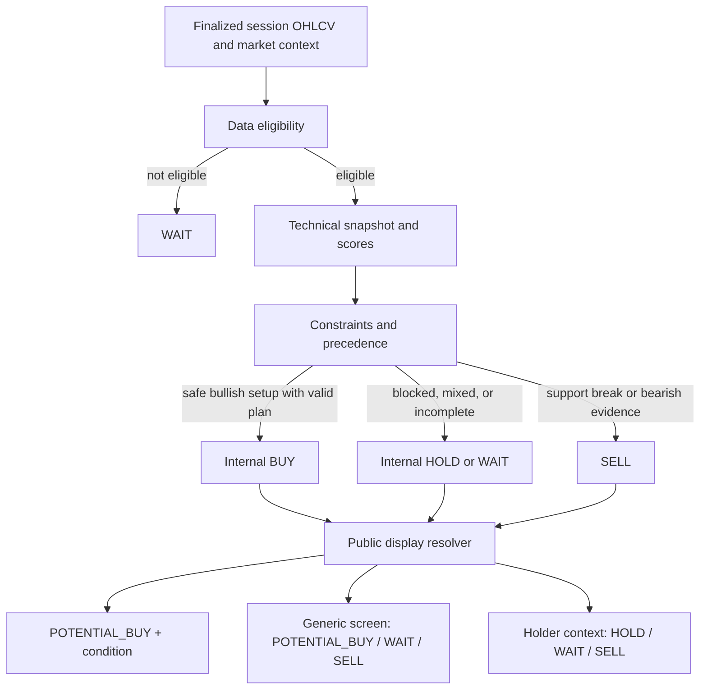

# Decision Logic Reference

This is the short, practical explanation of how a stock moves from market data
to a trader-facing decision. It complements the [three-phase plan](decision_model_evolution_three_phase_plan.md).
The calculation is deterministic; no AI or probability model is involved.

## The decision path

## 1. Inputs and session rules

The engine uses the latest completed exchange session, not an unfinished live
bar. It reads:

- OHLCV history and traded-session dates;
- market-regime summaries;
- stock category, sector, and liquidity data; and
- corporate-action dates and data-quality flags.

`decision_session_date` is the canonical date. Live freshness metadata is kept
separate, so a later intraday update cannot rewrite the completed-session
decision.

## 2. Data eligibility comes first

Before scoring, the engine checks history length, valid prices/volume, session
coverage, freshness, suspicious rows, corporate-action continuity, and stock
status.

| Status | Meaning | Fresh directional decision |
|---|---|---|
| `ELIGIBLE` | Data passes the policy | Allowed |
| `LIMITED` | Usable with reduced coverage or quality | Not allowed |
| `REVIEW_ONLY` | Important uncertainty requires review | Not allowed |
| `INELIGIBLE` | Data cannot support a decision | Not allowed |

The current minimum history policy is 20 valid OHLCV rows. Anything other than
`ELIGIBLE` fails closed to a non-actionable public result.

## 3. Technical snapshot and calculations

The snapshot supplies RSI, SMA/EMA levels, 5-session and 20-session returns,
volatility, opening-gap frequency, support, resistance, trend, market structure,
breakout state, volume baseline, and turnover.

The main scores are separate; they must not be read as one confidence value:

| Result | Calculation | Purpose |
|---|---|---|
| `opportunity_score` | Trend 28% + momentum 22% + volume 20% + price position 20% + risk adjustment 10% | Compatibility long-setup score, 0–100 |
| compatibility `risk_score` | Volatility 25% + category 20% + liquidity 20% + data quality 15% + stale/sparse data 10% + overextension 10% | Legacy risk projection |
| `trading_risk` | Volatility/gaps 55% + category 25% + overextension 20% | Fresh-entry risk gate |
| directional evidence | Trend 50% + multi-session momentum 30% + level event 20% | Bullish, bearish, neutral, or unknown direction |
| `evidence_strength` | Directional agreement adjusted by known-data coverage | Heuristic evidence score, not probability |

Directional evidence is bullish when bullish support exceeds bearish support by
12 points; it is bearish at the opposite margin. Missing
components reduce coverage instead of being invented.

## 4. Opportunity quality and entry plan

`opportunity_quality` is based on opportunity score, trend, and directional
evidence:

- `STRONG`: opportunity score is at least 55, trend is up, and evidence is bullish;
- `CONSTRUCTIVE`: opportunity score is at least 48 and trend is up;
- `WEAK`: everything else.

The plan builder then selects one timing:

| Timing | Meaning | Replay behavior |
|---|---|---|
| `READY` | Current entry range is actionable | Next eligible session |
| `PULLBACK` | Wait for a defined support/average-price zone | Fill only when the zone trades before expiry |
| `BREAKOUT` | Wait for a close above the trigger with participation | Confirm first, then enter the following session |
| `CONTINUATION` | Completed breakout with a narrow trailing-management policy | Next eligible session |

`entry_readiness` is `READY` only for `READY` timing, `CONDITIONAL` for the
other valid timings, and `NOT_READY` when the plan is invalid or unavailable.
`VALID_ENTRY_PLAN` also requires ordered entry/stop/target levels and at least
1.2 risk/reward. Target-less continuation is the explicit trailing-management
exception.

## 5. Constraints and internal recommendation

Constraints are applied in this order:

1. data eligibility and unresolved corporate actions;
2. support failure or reliable bearish evidence;
3. high trading risk, illiquidity, or other tradability blocks;
4. directional evidence and trend;
5. entry-plan feasibility; then
6. holder/non-holder context.

The internal compatibility recommendation is selected as follows:

| Internal result | Typical reason |
|---|---|
| `BUY` | Bullish evidence, strong opportunity, actionable readiness, and valid plan with no earlier block |
| `HOLD` | Constructive setup, but a downgrade such as resistance, extension, regime, or structure prevents a fresh entry |
| `WAIT` | Data block, invalid plan, mixed evidence, or risk/tradability block |
| `SELL` | Support break or coherent bearish trend/momentum |

Risk alone does not create `SELL`; it blocks or downgrades a fresh entry.
`primary_reason` explains the selected branch, while `blocker_codes` records the
machine-readable gates that prevented a stronger action.

## 6. Public action labels

The API enum is `POTENTIAL_BUY` (the UI renders “Potential Buy”). It is not a
renaming of every internal `BUY`; it is a strict, fail-closed projection.

`POTENTIAL_BUY` requires all of these values from the same completed session:

- internal action is `BUY`;
- `opportunity_quality` is `STRONG`;
- readiness is `READY` or `CONDITIONAL`;
- timing is one of `READY`, `PULLBACK`, `BREAKOUT`, or `CONTINUATION`;
- plan status is `VALID_ENTRY_PLAN`; and
- `entry_condition` is present and actionable.

The public resolver then applies this simple mapping:

| Internal/canonical state | Generic public action |
|---|---|
| Strict valid `BUY` above | `POTENTIAL_BUY` plus the entry condition |
| `SELL` | `SELL` |
| `HOLD`, incomplete `BUY`, invalid plan, legacy/incomplete payload, or no edge | `WAIT` |

The generic public action is therefore portfolio-neutral. It does not tell a
holder to keep or exit a position.

## 7. Holder-aware watchlist action

The shared universe decision remains user-independent. The watchlist applies
the user context only at presentation time:

| Holder action | Display action |
|---|---|
| `HOLD` | `HOLD` |
| `REVIEW` | `WAIT` |
| `SELL` or `REDUCE` | `SELL` |

Non-holders use the generic `display_action`, so the same stock can correctly
show `Potential Buy` to a non-holder and `Hold` to an existing holder.

## 8. Market Pulse and other projections

Pulse Score is an attention score, not a recommendation:

- trend: up to 35 points;
- momentum: up to 30;
- volume: up to 25;
- signal boost: up to 10; and
- risk penalty: down to 20.

Only eligible, same-session universe rows compete for focus. The default focus
threshold is 60, with a maximum of five focus stocks and sector-diversification
rules. Pulse labels and triggers explain why a stock deserves attention; the
canonical `display_action` still controls the action badge.

Dashboard, Scanner, Signals, Explorer, and non-holder Watchlist consume the same
canonical row. They do not recompute a separate recommendation.

## 9. Replay interpretation

Backtests use only completed, point-in-time sessions. Outcomes are measured from
the actual simulated entry, not automatically from the signal date. Reports
separate `READY`, `PULLBACK`, `BREAKOUT`, and `CONTINUATION` cohorts at 3, 5, 10,
and 20 sessions, including fills, expiry/invalidation, returns, hit rate,
expectancy, MFE/MAE, drawdown, liquidity, and regime results.

Daily bars cannot prove intraday stop/target order. Missing history, unresolved
corporate actions, zero-volume bars, and conditional plans that never activate
remain explicit unavailable or expired outcomes; they are not converted to
flat returns.

## Reading a decision quickly

For a `POTENTIAL_BUY`, read `entry_timing` and `entry_condition` before acting.
For `WAIT`, read `primary_reason` and `blocker_codes` to see what must improve.
For `SELL`, verify that the reason is support failure or coherent bearish
evidence, not merely a high-risk label. For a holding, use the holder-context
action rather than the generic non-holder label.
