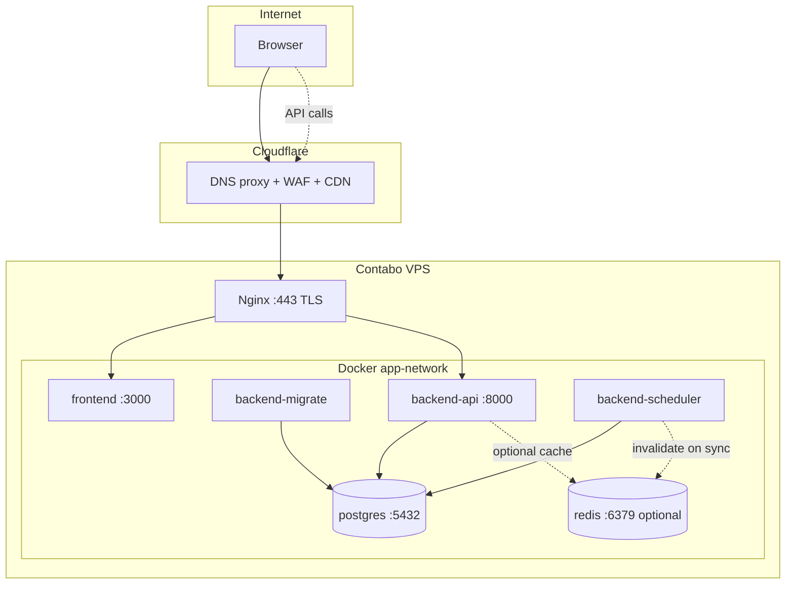
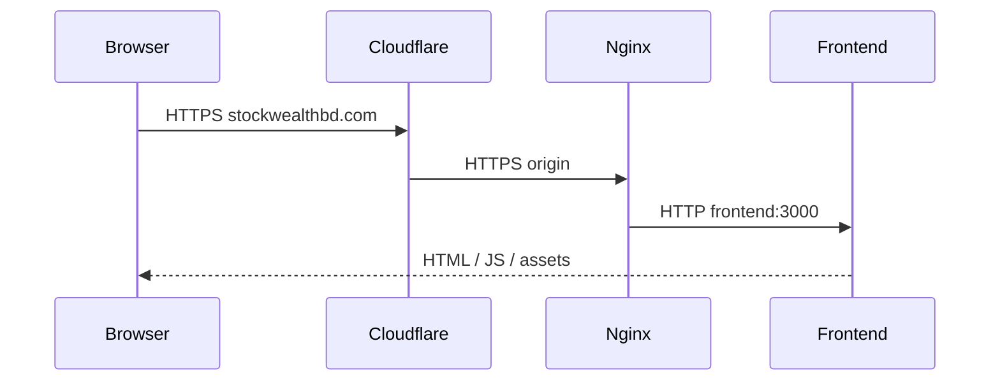
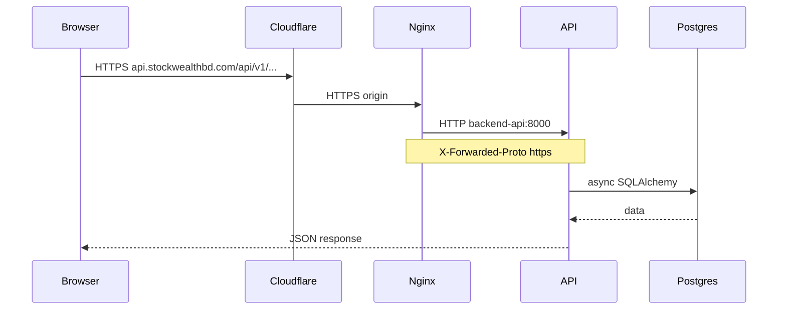

# Production Deployment Architecture

This document explains how Smart Stock is deployed to production: components, traffic flow, and the design choices behind the Docker setup.

For step-by-step commands, see [`deploy/README.md`](../../deploy/README.md).

---

## Overview

Production runs on a **single Ubuntu VPS** (Contabo) using **Docker Compose**. **Cloudflare** sits in front as DNS proxy, WAF, and CDN. **Nginx** on the VPS terminates TLS (Full Strict with Cloudflare) and reverse-proxies to internal containers.

| Domain | Service |
|--------|---------|
| `stockwealthbd.com` | Next.js frontend |
| `api.stockwealthbd.com` | FastAPI backend |

PostgreSQL is **internal only** — not exposed on the host.

---

## Components



| Component | Role | Process |
|-----------|------|---------|
| **Cloudflare** | Public edge — DNS, TLS to visitors, DDoS protection | Managed service |
| **Nginx** | Origin TLS, reverse proxy, real client IP from `CF-Connecting-IP` | `nginx:1.27-alpine` |
| **frontend** | Next.js App Router (standalone build) | `node server.js` |
| **backend-migrate** | One-shot database migration job | `alembic upgrade head` |
| **backend-api** | REST API | Gunicorn + Uvicorn workers |
| **backend-scheduler** | Background jobs only — no HTTP | `python -m app.jobs.scheduler` |
| **postgres** | Primary database | `postgres:17-alpine` |
| **redis** | Optional dashboard section cache | `redis:7-alpine` — omit `REDIS_URL` to run without Redis |

Dashboard cache architecture: [market_dashboard.md](market_dashboard.md). Phase 3 completes migration off `GET /market/price-windows` for the trader dashboard — seven section endpoints under `/dashboard/*`.

---

## Request flows

### Browser → frontend



### Browser → API



The frontend calls the API **from the browser** using `NEXT_PUBLIC_API_BASE_URL` (baked at Docker build time). Server-side Next.js does not proxy API traffic through Nginx internally.

---

## Why API and scheduler are split

Market data and email jobs previously started inside the FastAPI process (`app.main` lifespan). That breaks down with **Gunicorn multi-worker** — each worker would start duplicate schedulers.

**Solution:**

| Container | `RUN_SCHEDULER` | Runs |
|-----------|-----------------|------|
| `backend-api` | `false` | HTTP only (2+ workers) |
| `backend-scheduler` | `true` | `python -m app.jobs.scheduler` — no FastAPI |

The scheduler entrypoint:

- **Fail-fast** if `RUN_SCHEDULER=false`
- **Fail-fast** (exit 1) if initialization fails — Docker `restart: unless-stopped` recovers
- **Graceful shutdown** on SIGTERM/SIGINT — stops APScheduler and cancels asyncio market-data tasks
- **No HTTP healthcheck** — operability via `docker compose logs backend-scheduler`

Per-job toggles (`MARKET_SNAPSHOT_SCHEDULER_ENABLED`, `DAILY_MARKET_SYNC_SCHEDULER_ENABLED`) are read from **environment** at scheduler startup. See [Configuration precedence](#configuration-precedence) for how admin DB settings relate to Docker env.

---

## Configuration precedence

Backend settings come from several places. They are **not** duplicate config systems — they are layers with different roles.

```text
core_config.py     → schema + defaults (what settings exist)
.env.docker / .env → values injected at container or process start
admin_config_settings → optional DB overrides (subset, admin UI)
```

`get_settings()` in [`core_config.py`](../app/core/core_config.py) loads **`Settings` from environment variables** (cached with `@lru_cache`). Docker Compose injects the repo-root `.env` into `backend-api` and `backend-scheduler`. [`.env.docker.example`](../../.env.docker.example) is the production template for that file — it does not bypass `core_config.py`; it **feeds** it.

### What each layer controls

| Category | Examples | Admin panel | Runtime source today |
|----------|----------|-------------|----------------------|
| **Infrastructure** | `DATABASE_URL`, `JWT_SECRET_KEY`, SMTP, OAuth secrets, `RUN_SCHEDULER`, `WEB_CONCURRENCY`, `FORWARDED_ALLOW_IPS`, `BACKEND_CORS_ORIGINS`, `FRONTEND_BASE_URL` | Not editable | **Environment only** |
| **Operational** | `MARKET_*` times, scheduler toggles, `AMARSTOCK_*_ENABLED` ingestion flags | Editable (`SAFE_OPERATIONAL_SETTINGS`) | **Environment only** (see caveat) |
| **Frontend (browser)** | `NEXT_PUBLIC_API_BASE_URL`, feature flags | Not applicable | **Docker build time** only |

`RUN_SCHEDULER` is set **per service** in `docker-compose.yml` (`false` on `backend-api`, `true` on `backend-scheduler`). It is not admin-editable and gates whether a process may start schedulers at all.

### Intended vs current behavior (admin DB)

[`admin_panel.md`](admin_panel.md) describes operational settings as overridable in `admin_config_settings`. The admin UI lists each key with `source: "environment"` or `source: "database"`.

**Current runtime:** schedulers and jobs call `get_settings()` directly. That reads **env only** — it does **not** merge DB rows from `admin_config_settings`. So:

- Values in `.env` (from `.env.docker.example` on the VPS) are what production **actually runs with** after container start.
- Changes in **Admin → Configuration** are **persisted and shown in the UI**, but **do not automatically change** scheduler or ingestion behavior until an effective-settings resolver is implemented.

This applies equally in local dev and Docker; Docker only makes the env layer more visible because all backend config goes through root `.env` + compose.

### Practical rules for production

| If you need to change… | Do this |
|------------------------|---------|
| Secrets, DB URL, CORS, mail, JWT | Edit root `.env`, then `docker compose up -d` (restart api + scheduler) |
| Default market / ingestion behavior | Edit root `.env` first; treat admin panel as stored preferences until DB→runtime merge exists |
| Whether schedulers run in a container | `RUN_SCHEDULER` in `docker-compose.yml` (not admin) |
| Public API URL in the browser | `NEXT_PUBLIC_*` in `.env`, then `docker compose build frontend` |

After any env change, restart affected containers. `get_settings()` is cached for the process lifetime.

### Overlap without automatic conflict

The same keys (e.g. `MARKET_SNAPSHOT_SCHEDULER_ENABLED`) can appear in both `.env` and `admin_config_settings`. There is no file-level conflict, but the UI may show a DB value while the scheduler still uses the env value. **Env wins at runtime** until DB merge is built.

Scheduler toggles in admin are marked `requires_restart: true` — even after DB merge, `backend-scheduler` would need a restart to pick up changes.

### Client cache rollout (browser)

Market intelligence is cached in the **browser** (IndexedDB + TanStack Query), not at Cloudflare. Deploying a new frontend build:

1. **IndexedDB:** Market entries written before schema v2 are ignored automatically. Generation mismatches delete only the affected URL's IndexedDB row and refetch from the API.
2. **TanStack:** `MarketCacheSyncCoordinator` reconciles generation-stamped queries when freshness loads; full market bust runs when `last_synced_at` advances.
3. **Redis (optional):** Do **not** flush Redis. After a response-schema change, optionally delete only legacy keys (e.g. `pulse:summary:*` entries missing `last_synced_at`) — PostgreSQL remains authoritative. See `backend/docs/market_caching.md` operational notes.
4. **Cloudflare:** Unchanged — HTML/RSC/API bypass rules still apply; only `/_next/static/*` is edge-cached.

### Related docs

- Full admin rules: [`admin_panel.md`](admin_panel.md)
- Local env template: [`backend/.env.example`](../.env.example)
- Docker env template: [`.env.docker.example`](../../.env.docker.example)

---

## TLS and proxy trust

```text
Browser ──TLS──► Cloudflare ──TLS──► Nginx ──HTTP──► backend-api:8000
```

- **Cloudflare SSL mode:** Full (strict) — origin must present a valid certificate.
- **Certificates:** Let's Encrypt or Cloudflare Origin Certificate in `deploy/certs/`.
- **Gunicorn `forwarded_allow_ips`:** Restricted to `127.0.0.1` and Docker subnet `172.28.0.0/16` — only Nginx reaches the API on the internal network. Cloudflare never contacts Gunicorn directly, so Cloudflare IP ranges are configured in **Nginx** (`real_ip_header CF-Connecting-IP`), not in Gunicorn.

---

## Database and migrations

- PostgreSQL 17 Alpine with a named volume `postgres_data`.
- `backend-migrate` is a one-shot Compose service. `backend-api` and
  `backend-scheduler` do not start until it exits successfully.

- A normal full deploy runs migrations automatically:

  ```bash
  docker compose up -d --build
  ```

- For recovery or a migration-only rollout, run the job explicitly:

  ```bash
  docker compose run --rm backend-migrate
  ```

- Never run migrations in the Dockerfile build or in the API entrypoint. This
  keeps image builds database-independent and prevents concurrent API workers
  from racing on DDL.

- Readiness: `GET /api/v1/health/ready` runs `SELECT 1` — used by the `backend-api` Docker healthcheck.


---

## Environment variables

| Variable | When set | Notes |
|----------|----------|-------|
| `NEXT_PUBLIC_*` | **Docker build** (`docker compose build`) | Baked into frontend JS; not backend `Settings` |
| `JWT_SECRET_KEY`, `DATABASE_URL`, etc. | **Runtime** (root `.env`) | Never commit secrets; feeds `get_settings()` |
| `RUN_SCHEDULER` | **Per service** in compose | `false` on api, `true` on scheduler |
| `FORWARDED_ALLOW_IPS` | **backend-api** runtime | Docker internal subnet |

Copy [`.env.docker.example`](../../.env.docker.example) to `.env` at the repo root.

Operational keys in that file overlap with admin-editable settings — see [Configuration precedence](#configuration-precedence).

---

## Security choices

| Choice | Rationale |
|--------|-----------|
| Non-root containers | `appuser` (backend), `node` (frontend), official image users (postgres, nginx) |
| Postgres not on public interface | Bound to `127.0.0.1:5432` on the host for SSH tunnel access only; no UFW rule for 5432 |
| Log rotation on api/scheduler/nginx | `json-file` max 10m × 5 files — prevents disk fill on single VPS |
| Internal Docker network | Services resolve by name (`postgres`, `backend-api`, `frontend`) — never `localhost` |

---

## Local development vs production

| | Local | Production Docker |
|---|-------|-------------------|
| API | `uvicorn app.main:app --reload` | Gunicorn in `backend-api` |
| Schedulers | Optional `RUN_SCHEDULER=true` with uvicorn | Dedicated `backend-scheduler` container |
| Database | `localhost:5432` | `postgres:5432` |
| Frontend API URL | `http://localhost:8000/api/v1` | `https://api.stockwealthbd.com/api/v1` (build-time) |
| Frontend dev cache | `.next/dev/cache` (Turbopack; can grow large) | Not present — image runs `node server.js` from standalone build only |

### Frontend `.next` cache (local only)

`npm run dev` accumulates Turbopack cache under `frontend/.next/`. It is gitignored and never copied into the production image (`frontend/Dockerfile` copies only `.next/standalone` and `.next/static`).

If local disk use is high or dev feels sluggish, stop the dev server and run from `frontend/`:

```bash
npm run clean
```

See [`frontend/README.md`](../../frontend/README.md).

---

## File map

```
docker-compose.yml          # Service definitions
.env.docker.example         # Environment template
deploy/
  README.md                 # Operational runbook
  nginx/                    # Reverse proxy config
  certs/                    # TLS certificates (gitignored)
  scripts/                  # backend entrypoint, postgres wait
backend/Dockerfile
frontend/Dockerfile
```

---

## Deferred (not in MVP)

- CI/CD pipelines and image registries
- Automated backups and monitoring stacks
