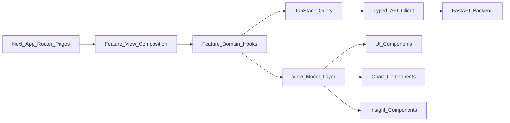

# Frontend Architecture Plan

## Purpose

The Smart Stock frontend should become a persistent institutional market workspace for Bangladesh stock intelligence, not a set of disconnected pages. The approved visual direction remains the reference: terminal-grade dark mode, elegant institutional light mode, chart-centered hierarchy, insight sidebars, market intelligence cards, heatmaps, and calm premium motion.

The frontend must help traders quickly answer:

- What is happening in the market?
- Which stocks deserve attention?
- What opportunities exist?
- What risks exist?
- Why was a signal generated?

## Architecture Principles

- Preserve the established institutional fintech identity; do not redesign from scratch.
- Keep App Router pages thin and move product logic into feature modules.
- Use explicit view models so backend DTOs do not leak into components.
- Treat market freshness, partial data, and suspicious source validation as first-class UX states.
- Build reusable modules that can scale from daily EOD data to future real-time and AI-assisted workflows.
- Prefer deterministic trading logic first; AI should explain and prioritize later, not become the source of truth.

## Feature-Based Frontend Modules

Move toward this structure:

```text
frontend/
  app/
  features/
    market-dashboard/
      components/
      hooks/
      view-models/
      services/
      types/
    stock-workspace/
      components/
      hooks/
      view-models/
      services/
      types/
    scanner/
      components/
      hooks/
      view-models/
      services/
      types/
    signals/
      components/
      hooks/
      view-models/
      services/
      types/
    watchlist/
      components/
      hooks/
      view-models/
      services/
      types/
  components/
    charts/
    command/
    layout/
    tables/
    ui/
  hooks/
  lib/
    api/
    command/
    formatters/
    insights/
    market/
  stores/
```

Feature modules own feature-specific UI, hooks, view models, services, and types. Shared components should remain generic and reusable across product areas.

## Data Flow



Rules:

- App Router pages should compose feature views only.
- Components should receive chart models, UI models, insight models, or table row models.
- Components should not parse backend decimals, inspect raw metadata, infer risk, or call APIs.
- Backend response envelopes should be unwrapped in the API layer.

## View Model Layer

The view-model layer transforms backend DTOs into frontend-ready models:

- Chart models: `ChartCandle`, `VolumeBar`, `IndicatorSeries`, `SignalMarker`, `EventMarker`, `HeatmapTile`.
- UI models: `MarketTapeItem`, `MetricCardModel`, `StockHeaderModel`, `SignalFeedItemModel`, `ScannerResultModel`.
- Insight models: `InsightBlockModel`, `SignalExplanationModel`, `RiskNarrativeModel`, `MarketMoodModel`.
- Formatted analytics models: values annotated with unit, precision, tone, freshness, and null state.

Backend DTOs remain in `lib/api`. Feature view-model builders live in `features/*/view-models`. Formatting belongs in `lib/formatters`.

## Market Session Engine

Create `lib/market/market-session-engine.ts` with these states:

- `PRE_OPEN`
- `OPEN`
- `POST_CLOSE`
- `HOLIDAY`
- `STALE`
- `PARTIAL`
- `SYNCING`

The engine should use Asia/Dhaka trading context, latest market summary dates, latest price dates, data quality flags, sync job state, and future stream state.

Session state should drive:

- TanStack Query polling cadence.
- Market tape labels.
- Freshness badges.
- Live or delayed indicators.
- Disabled interactions when data is stale or syncing.
- Chart overlays for stale, partial, or suspicious data.
- Scanner confidence and watchlist alert urgency.

Do not imply live data until a real-time source exists.

## Insights Module

Create `lib/insights` as a dedicated reasoning layer.

Insight evolution:

```text
deterministic insight
  -> hybrid insight
  -> AI-generated analysis
```

Initial deterministic insights should be auditable and based on available market data, indicators, signals, valuation, ownership, and data quality. Examples include momentum strengthening, RSI recovery, volume accumulation, elevated volatility, weak confirmation, suspicious data, or valuation stretch.

Future hybrid and AI-generated insights should map into the same `InsightBlockModel` contract with provenance, confidence, and source context.

## Command System

Add a global command/search palette inspired by Raycast, Linear, and Superhuman.

Support:

- Stock search and direct navigation.
- Page navigation.
- Quick actions such as add to watchlist, copy symbol, switch watchlist, open scanner, or filter signals.
- Scanner category jump.
- Signal lookup.
- Recently viewed stocks.

Suggested files:

- `lib/command/command-types.ts`
- `lib/command/command-registry.ts`
- `lib/command/command-search.ts`
- `components/command/global-command-palette.tsx`
- `stores/use-command-store.ts`

Features should register command entries; the global palette renders and executes them.

## Workspace Architecture

The product should behave like a persistent market workspace.

Prepare for:

- Resizable panels.
- Collapsible sidebars and insight rails.
- Remembered chart state: timeframe, indicators, overlays, chart type, and panel visibility.
- Remembered layout preferences: sidebar state, panel widths, table density, visible columns, active tabs.
- Recently viewed symbols and scanner categories.
- Local persistence first, backend persistence later.

Use Zustand only for app-wide UI/workspace state. Do not duplicate server state from TanStack Query.

## Table Strategy

Use TanStack Table for stock explorer, signal center, scanner results, and watchlist tables.

Requirements:

- Sticky headers.
- Virtualized rows for large datasets.
- Feature-owned column definitions.
- Server-side filtering and sorting readiness.
- URL-synced filters where useful.
- Compact density options and aligned financial numerals.
- Keyboard navigation and quick-preview actions.
- Loading, empty, filtered-empty, stale, and partial-data states.

## Visualization Strategy

Use TradingView Lightweight Charts for the stock detail workspace and realistic market charting.

Principles:

- Transform price DTOs into chart-safe numeric models before rendering.
- Dynamically import heavy chart workspaces.
- Avoid remounting charts for normal series updates.
- Keep chart theme synced to design tokens.
- Handle missing, stale, partial, and suspicious data explicitly.
- Add overlays incrementally: candles and volume first, then SMA/EMA, RSI/MACD panels, signal markers, and event overlays.

## Watchlist Architecture

Watchlist Intelligence should support:

- Grouped watchlists.
- Local persistence first.
- Signal summaries by group.
- Heatmap mode.
- Quick analytics such as group performance, concentration, volume anomalies, and risk mix.
- Alert-oriented UX that explains what changed and why it matters.
- Mobile companion behavior focused on alerts and quick review.

Backend watchlist APIs can be added later without changing the frontend mental model.

## Accessibility And Performance

Accessibility:

- Keyboard-first navigation for command palette, stock search, tables, tabs, scanner cards, and chart controls.
- Visible focus states.
- Semantic landmarks for shell, navigation, main workspace, sidebars, and feeds.
- Accessible labels for badges, icon buttons, market values, and chart controls.
- Do not rely on red/green alone.
- Respect reduced motion.

Performance:

- Lazy-load charts and secondary workspaces.
- Use Suspense boundaries around chart workspaces, large tables, and heavy panels.
- Memoize view-model builders for price series, table rows, and signal feeds.
- Virtualize large tables and long feeds.
- Avoid decimal parsing inside render loops.
- Prioritize mobile loading around market summary, alerts, and watchlist state.

## Implementation Priority

1. Frontend foundation: dependencies, Tailwind/shadcn, theme tokens, app shell, typed API client, query provider, feature folders.
2. View-model and session foundations: DTO adapters, market session engine, insights contracts, command registry, workspace store.
3. Design system: cards, badges, gauges, trend indicators, skeletons, table primitives, chart containers, accessibility states.
4. Market Dashboard V1: hero intelligence, breadth, heatmap, movers, smart signal feed, timeline, freshness/session behavior.
5. Stock Detail Workspace V1: lookup, candles/volume chart, header, indicators, signals, insight sidebar, remembered chart state.
6. Stock Explorer V1: searchable screener, TanStack Table, filters, sticky/virtualized rows, quick preview.
7. Signal Center V1: explanation-first signal feed and market-wide endpoint contract.
8. Scanner V1: card-based opportunity detection from available data, then backend scanner endpoint integration.
9. Watchlist Intelligence V1: grouped local watchlists, heatmap mode, signal summaries, alert-focused UX.
10. Production polish: responsive behavior, command palette, workspace persistence, accessibility, performance, and backend API gap documentation.

## Trader-Usable V1 Implementation Notes

The current frontend milestone has moved from placeholder mockups to the first usable trader workflow:

```text
Dashboard -> discover opportunities -> inspect stock -> analyze chart + insights -> understand signal context
```

Implemented frontend behavior:

- Market Dashboard now derives heatmap tiles, movers, market breadth, market condition, signal feed, and timeline items from active stocks plus recent per-stock `daily_prices`.
- Market heatmap tile size uses market cap when available, with turnover fallback; color uses latest price-change percentage.
- Market movers are derived as top gainers, losers, turnover leaders, and volume leaders from the loaded market universe.
- Deterministic signal generation uses price momentum, RSI, moving-average context, volume expansion, volatility, and data quality.
- Stock Detail Workspace uses `exchange + symbol` lookup, historical OHLCV, TradingView Lightweight Charts, technical summaries, deterministic insights, and available stock fundamentals.
- Stock Explorer uses TanStack Table over the same derived stock intelligence models.
- Signal Center is now explanation-first and reuses deterministic signal models instead of static BUY/SELL cards.
- Scanner Workspace derives RSI, momentum, unusual-volume, and breakdown-risk scans from available OHLCV.

Important current backend constraint:

- There is no market-wide latest-prices endpoint yet. The frontend currently builds a market universe by loading active stocks and then fetching recent prices per stock. This is correct for Trader-usable V1, but the next backend optimization should add an aggregate endpoint such as `GET /api/v1/market/latest-prices` or `GET /api/v1/market/overview` to reduce request fan-out.
